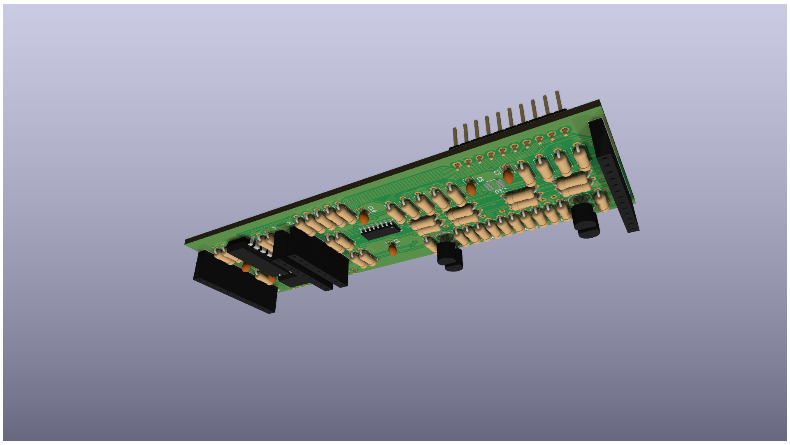
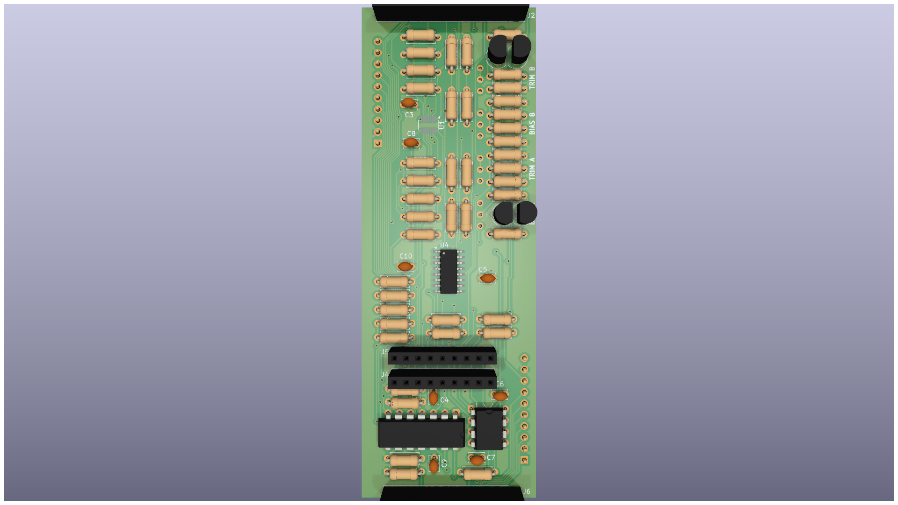
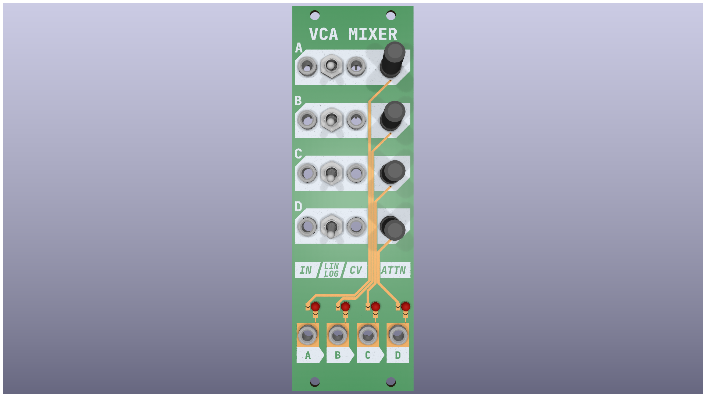

= Quad VCA Mixer
:page-layout: default

== Overview

The Quad VCA Mixer is a 4-channel voltage controlled amplifier and mixer module for Eurorack modular synthesizers.

=== Features

* 4 independent VCA channels
* Linear and exponential response modes
* Built-in mixer with individual level controls
* Compact 8HP design

[IMPORTANT]
====
This module requires +12V and -12V power rails. Always check your power supply capacity before installation.
====

== Technical Specifications

[cols="1,2"]
|===
| Parameter | Value

| Width
| 8HP

| Depth
| 35mm

| Power Consumption
| +12V: 50mA, -12V: 45mA

| Input Impedance
| 100kΩ

| Output Impedance
| 1kΩ
|===

== PCB Assembly

=== Middle Board

The middle board contains the main VCA circuitry and mixing stage.

[NOTE]
====
Pay special attention to IC orientation during assembly. Pin 1 is marked on both the PCB and component.
====

=== Component Placement

Follow these steps for optimal assembly:

1. Start with the lowest profile components (resistors, diodes)
2. Install IC sockets
3. Add capacitors (observe polarity on electrolytics)
4. Install connectors last

[TIP]
====
Use a PCB holder or helping hands tool to keep the board steady during soldering.
====

=== Front Panel

The front panel is designed with KiCad and features white silkscreen graphics on black PCB.

[CAUTION]
====
Handle the front panel carefully to avoid scratching the black solder mask finish.
====

== Circuit Description

The VCA topology uses the SSM2164 quad VCA chip, providing excellent performance characteristics:

* Low distortion (<0.1% THD)
* Wide dynamic range (>110dB)
* Fast response time

[source,text]
----
VCA Response Modes:
- Linear: Direct 1:1 CV to amplitude mapping
- Exponential: Musical response for dynamics control
----

== Calibration

[WARNING]
====
Calibration requires test equipment including an oscilloscope and audio signal generator.
====

Calibration procedure:

1. Apply a 1kHz sine wave at 1Vpp to input
2. Adjust trimmer R15 for unity gain at 0V CV
3. Apply +5V CV and adjust R16 for maximum gain
4. Verify THD is below 0.1%

== Troubleshooting

.Common Issues
****
*No output signal*::
Check power supply voltages and IC orientation

*Distorted output*::
Verify gain calibration and input signal levels

*Crosstalk between channels*::
Ensure proper grounding and check for solder bridges
****

== Downloads

* link:_attachments/schematic.pdf[Schematic PDF]
* link:_attachments/bom.csv[Bill of Materials]
* link:_attachments/gerbers.zip[PCB Fabrication Files]

== Revision History

[cols="1,1,3"]
|===
| Version | Date | Changes

| 1.0
| 2024-10-15
| Initial release

| 1.1
| 2024-11-01
| Updated power connector footprint
|===
